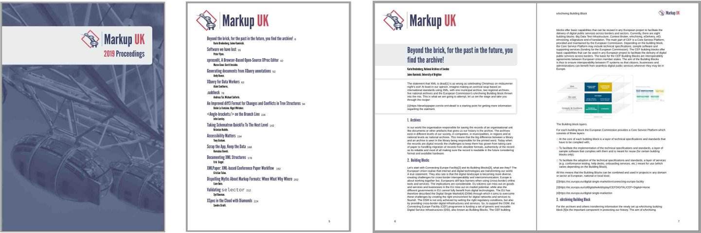

# XSL Stylesheets for MUK Proceedings

This repository contains the XSLT for the Markup UK Proceedings, including a couple of files that customise a modified v 1.79 of the DocBook XSLT 1.0 stylesheets. The styles are based on the styles of the Markup UK website.



This repository is usually used as a submodule of a main project.

## `git clone` from main project

Use `--recurse-submodules` when cloning the main project to also initialise its copy of this submodule; for example:

```
git clone --recurse-submodules https://github.com/MarkupUK/paperFramework
```

## `git pull` from main project

```
git pull --recurse-submodules origin master
```

## Working on the submodule

See https://git-scm.com/book/en/v2/Git-Tools-Submodules#_working_on_a_submodule

The default branch is `main`.
